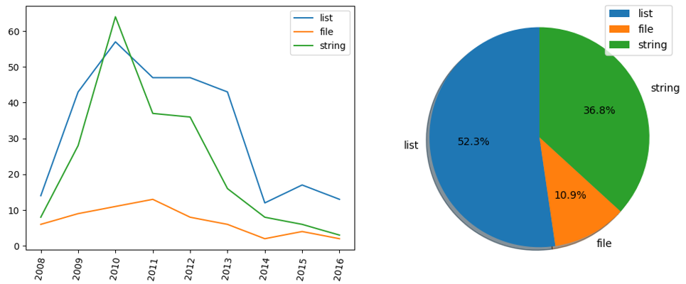

## Fundamentos de Programación
# Ejercicio de laboratorio: Stackoverflow
### Autor: José A. Troyano
### Revisora: Toñi Reina

En este proyecto trabajaremos con preguntas sobre el lenguaje Python. Los datos están extraídos de [stackoverflow](https://stackoverflow.com), y se corresponden con una colección de preguntas desde 2008 hasta 2016 relacionadas con Python. La colección completa está disponible en [Kaggle datasets](https://www.kaggle.com/stackoverflow/pythonquestions). Los datos con los que trabajaremos incluyen distintas informaciones sobre las preguntas y, a partir de ellos, generaremos una serie de informes y gráficas que resumirán aspectos relevantes de las temáticas más consultadas.


## Estructura de las carpetas del proyecto

* **/src**: Contiene los diferentes módulos de Python que conforman el proyecto.
    * **stackoverflow.py**: Contiene funciones para explotar los datos de stackoverflow.
    * **stackoverflow_test.py**: Contiene funciones de test para probar las funciones del módulo `stackoverflow`. En este módulo está el `main`.
    * **graficas.py**: Contiene funciones para dibujar gráficas.

* **/data**: Contiene el dataset o datasets del proyecto
    * **stackoverflow_python_questions.csv**: Archivo con las preguntas de stackoverflow sobre Python desde 2008 hasta 2016.
    * **stopwords.txt**: Archivo de texto con las llamadas _stopwords_, o palabras huecas, que no aportan significado a untexto.

## Dependencias
En este ejercicio vamos a trabajar con gráficas, para lo que necesitaremos la biblioteca 'matplotlib' . Para instalar la librería 'matplotlib' abre una ventana de comandos de Anaconda (Anaconda Prompt) y ejecuta el siguiente comando:
```
conda install matplotlib
```

## Enunciado
El formato de entrada es CSV. Cada registro del fichero de entrada ocupa una línea y contiene cuatro informaciones sobre las preguntas (puntuación, título, año y etiqueta principal). Estas son las primeras líneas del fichero de entrada:

```
score,title,year,tag
21,How can I find the full path to a font from its display name on a Mac?,2008,photoshop
27,Get a preview JPEG of a PDF on Windows?,2008,pdf
40,Continuous Integration System for a Python Codebase,2008,extreme-programming
25,cx_Oracle: How do I iterate over a result set?,2008,cx-oracle
28,Using 'in' to match an attribute of Python objects in an array,2008,iteration
30,Class views in Django,2008,oop
20,Python and MySQL,2008,bpgsql
```

Además de distintos indicadores, generaremos un par de salidas gráficas que mostrarán, respectivamente, la evolución y la distribución de uso de ciertas etiquetas (ver Figura 1):

| 
:-------------------------:
Figura 1             |  

Para almacenar estos datos en memoria, utilizaremos una tupla con nombre con la siguiente definición:

```
Pregunta = NamedTuple('Pregunta', [('puntuacion', int), 
                                   ('titulo',str), 
                                   ('anyo',int),
                                   ('etiqueta', str)])
```


Para explotar los datos de `stackoverflow`  Cada  operación  se implementará en una función distinta. Implemente y testee las funciones auxiliares indicadas en cada función. Las funciones a implementar son:

1. **leer_preguntas(fichero)**:
    dado el nombre (y ruta) de un fichero, lee el fichero de preguntas y devuelve una lista de tuplas de tipo 'Pregunta' con los datos leidos del fichero.
2. **filtrar_por_anyo(preguntas, anyo)**:
    dadas una lista una lista de preguntas y un año, devuelve una lista de las preguntas del año recibido como parámetro.
3. **obtener_etiquetas(preguntas)**:
    dada una lista de preguntas, devuelve el conjunto de etiquetas usadas en esas preguntas
4. **obtener_preguntas_mejor_valoradas(preguntas, n=10)**:
    dadas una lista de preguntas y un número n, devuelve una lista de tuplas (titulo, puntuacion) con el título y la puntuación de las n preguntas con las puntuaciones más altas. Si no se proporciona n, tomará como valor por defecto 10.
5. **mostrar_distribucion_etiquetas(preguntas, etiquetas)**:
    muestra un diagrama de tarta con la distribución de uso de varias etiquetas. El diagrama de tarta tendrá un sector por cada etiqueta recibida. Para resolver este ejercicio, descomponga el problema usando las siguientes funciones:

    a) **frecuencia_etiquetas(preguntas)**:
    dada una lista de preguntas, devuelve un diccionario en el que las claves son las etiquetas de las preguntas, y los valores el número de veces (frecuencia) que aparece esa etiqueta en las preguntas.
    
    b) **dibujar_grafica_tartas (etiquetas, frecuencias)**: 
    dadas una lista con etiquetas y una lista de números enteros que 
    representa la frecuencia con la que aparecen esas etiquetas, dibuja una gráfica de tartas con un sector por cada una de las etiquetas. Esta función debe añadirse al módulo `graficas`.

    
    Use las siguientes instrucciones para generar la gráfica, para lo que debe importar pyplot de la siguiente forma:
    ```python
    from matplotlib import pyploy as plt
    ```
    ```python
        plt.pie(frecuencias, labels=etiquetas, autopct='%1.1f%%', shadow=True, startangle=90)
        plt.legend()
        plt.show()
    ```
    donde la lista 'frecuencias' debe estar alineada con la lista de etiquetas.   

6.  **frecuencia_palabras_clave(preguntas, stopwords=[])**:
    dadas una lista de preguntas y una lista con palabras huecas, devuelve una lista de tuplas (palabra_clave, frecuencia) ordenada de mayor a menor frecuencia. Las palabras clave son aquéllas que aportan significado, es decir, que no son palabras huecas.

    a) **obtener_palabras_clave(titulo, stopwords=[])**:
    dadas una cadena de caracteres que representa un título, y una lista de palabras huecas (_stopwords_), devuelve ula lista con las palabras claves del título.

    Algunas cuestiones a tener en cuenta:
       - Debes trabajar con el título en minúsculas.
       - Debes descomponer el título en una lista de términos separados por espacios.
       - Debes eliminar los siguientes símbolos de los términos: '¿?[](){}¡!-+/*,;.<>='.
       - Debes dejar en la lista de términos solo aquellos que estén compuestos por letras.
       - Debes eliminar de la lista los términos que aparezcan el la lista de stopwords.


7. **mostrar_evolucion_etiquetas(preguntas, etiquetas)**:
    muestra la evolución del uso de etiquetas a lo largo del tiempo

    a) **agrupar_preguntas_por_año(preguntas)**:
    devuelve un diccionario cuyas claves son los años, 
    y cuyos valores son listas de preguntas que se hicieron ese año.
    
    b) **dibujar_grafica_lineas(nombre_serie, etiquetas_x, valores_y, rotacion=80)**:  
    dadas una lista de cadenas `nombre_serie` con los nombres de las series que se van a representar en la gráfica;
    una lista de cadenas `etiquetas_x` con las etiquetas que se van a poner en el eje X,
    una lista de listas de enteros con los valores a dibujar en el eje y para cada una de las series,
    y el ángulo de rotación de las etiquetas del eje X, dibuja una gráfica
    de líneas con esas tres series. Por ejemplo, si nombre_serie = ['list', 'file', 'string']
    y etiquetas_x= [2008,2009],  valores_y = [[50, 30, 20], [10,5,6]]
    Se representará una gráfica que en el eje X tendrá las etiquetas
    2008 y 2009, en la que se dibujarán 3 series (una para list, otra
    para file y otra para string). La lista de listas valores_y 
    indica que en el año 2008 la palabra 'list' apareció 50 veces, 
    'file' 30 veces y 'string' 20 veces. Y en el año 2009, 'list' apareció 10 veces; 'file', 5; y 'string', 6. 
    

    Se usarán las siguientes instrucciones para generar la gráfica:
    ```
         
    for serie, valor_y in zip(etiquetas_serie, valores_y):
        plt.plot(valor_y, label=serie)
    plt.xticks(range(len(etiquetas_x)), etiquetas_x, rotation=rotacion, fontsize=10)
    plt.legend()
    plt.show()
    ```
    Añada esta función al módulo `graficas`.

El resultado del test debe ser similar al siguiente:
```
Se han leido 42420 preguntas
Las diez primeras son:
                1-Pregunta(puntuacion=21, titulo='How can I find the full path to a font from its display name on a Mac?', anyo=2008, etiqueta='photoshop')
                2-Pregunta(puntuacion=27, titulo='Get a preview JPEG of a PDF on Windows?', anyo=2008, etiqueta='pdf')
                3-Pregunta(puntuacion=40, titulo='Continuous Integration System for a Python Codebase', anyo=2008, etiqueta='extreme-programming')
                4-Pregunta(puntuacion=25, titulo='cx_Oracle: How do I iterate over a result set?', anyo=2008, etiqueta='cx-oracle')
                5-Pregunta(puntuacion=28, titulo="Using 'in' to match an attribute of Python objects in an array", anyo=2008, etiqueta='iteration')
                6-Pregunta(puntuacion=30, titulo='Class views in Django', anyo=2008, etiqueta='oop')
                7-Pregunta(puntuacion=20, titulo='Python and MySQL', anyo=2008, etiqueta='bpgsql')
                8-Pregunta(puntuacion=256, titulo="How do I use Python's itertools.groupby()?", anyo=2008, etiqueta='iteration')
                9-Pregunta(puntuacion=364, titulo='Adding a Method to an Existing Object Instance', anyo=2008, etiqueta='monkeypatching')
                10-Pregunta(puntuacion=251, titulo='How do you express binary literals in Python?', anyo=2008, etiqueta='literals')
TEST de 'filtrar_por_anyo'
   - Número de preguntas en '2009': 4309
   - Las tres primeras son:
                1-Pregunta(puntuacion=8, titulo='Python globals  locals  and UnboundLocalError', anyo=2009, etiqueta='identifier')
                2-Pregunta(puntuacion=30, titulo='Determining application path in a Python EXE generated by pyInstaller', anyo=2009, etiqueta='pyinstaller')
                3-Pregunta(puntuacion=39, titulo='LBYL vs EAFP in Java?', anyo=2009, etiqueta='idioms')
   - Número de preguntas en '2015': 2873
   - Las tres primeras son:
                1-Pregunta(puntuacion=7, titulo='Django REST: How to use Router in application level urls.py?', anyo=2015, etiqueta='django-rest-framework')
                2-Pregunta(puntuacion=19, titulo='How `pip install` a package that has non-Python dependencies?', anyo=2015, etiqueta='pip')
                3-Pregunta(puntuacion=9, titulo='Getting certificate verify failed error with mechanize', anyo=2015, etiqueta='mechanize')
TEST de 'obtener_etiquetas'
   - Número de etiquetas: 5758
   - Diez primeras: ['', '.net', '.net-remoting', '16-bit', '1wire', '2-digit-year', '2d', '2to3', '32-bit', '32bit-64bit']

TEST de 'obtener_preguntas_mejor_valoradas'
   [5524] - What does the "yield" keyword do?
   [3219] - What is a metaclass in Python?
   [2729] - How do I check whether a file exists using Python?
   [2655] - Does Python have a ternary conditional operator?
   [2312] - Calling an external command in Python

TEST de 'frecuencia_etiquetas'
   python -> 2755
   pandas -> 845
   numpy -> 793
   matplotlib -> 693
   django -> 639

TEST de 'mostrar_distribucion_etiquetas'

TEST de 'obtener_palabras_clave'
   - Dejando stopwords: ['how', 'do', 'i', 'make', 'a', 'menu', 'that', 'does', 'not', 'require', 'the', 'user', 'to', 'press', 'enter', 'to', 'make', 'a', 'selection']
   - Quitando stopwords: ['menu', 'require', 'user', 'press', 'enter', 'selection']

TEST de 'frecuencia_palabras_clave'
   (solo las 5000 primeras preguntas para que la prueba sea más rápida)
   - Número de palabras: 3638
   - Diez primeras: [('python', 2756), ('django', 429), ('using', 332), ('list', 289), ('file', 240), ('string', 206), ('function', 133), ('class', 129), ('module', 122), ('object', 107)]

TEST de 'agrupar_preguntas_por_anyo'
   2008 -> 1175 preguntas
   2009 -> 4309 preguntas
   2010 -> 6315 preguntas
   2011 -> 7588 preguntas
   2012 -> 7876 preguntas
   2013 -> 6973 preguntas
   2014 -> 3835 preguntas
   2015 -> 2873 preguntas
   2016 -> 1476 preguntas

TEST de 'mostrar_evolucion_etiquetas'
```
